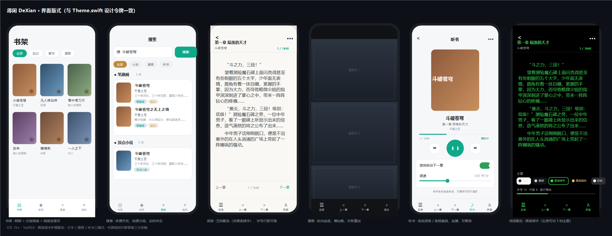
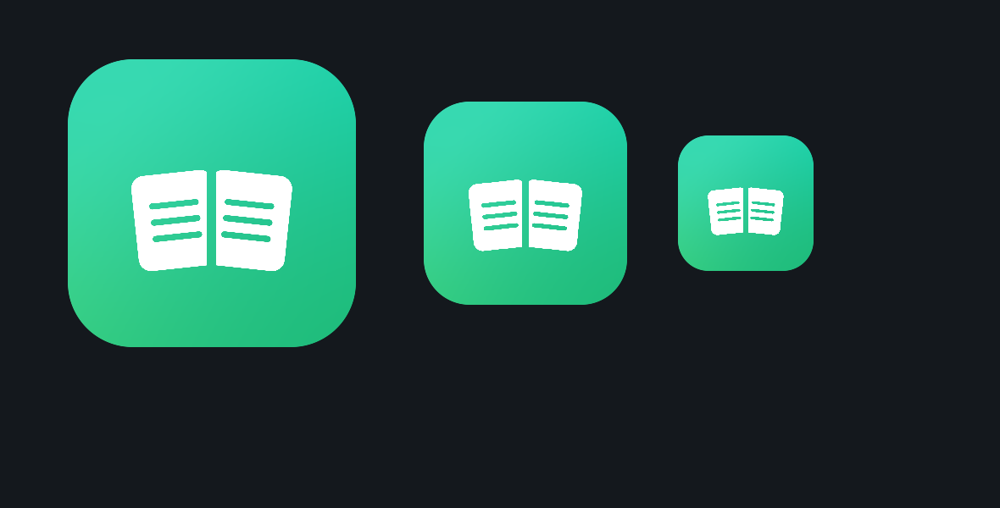

# 得闲 DeXian · iOS 阅读器

一个原生 SwiftUI 的 iOS 阅读 App，**完整支持阅读（Legado / 阅读 3.x）书源规则**，
可导入 [yckceo 书源仓库](https://www.yckceo.com/yuedu/shuyuan/index.html) 的书源，
支持小说、**漫画**与听书，无广告、无内购、无账号。

> 本项目是一个通用阅读工具：内容全部来自你自己导入的第三方书源。

---

## 界面预览

六个面板依次是：**书架 / 搜索 / 阅读 / 漫画 / 听书 / 阅读配色**。配色、间距、圆角、阴影全部取自工程内的 `Theme.swift` 设计令牌，浅色与深色各一套自动切换；最后一个面板演示的是「**黑底绿字**」阅读主题。

---

## 应用图标

青绿 → 草绿的品牌渐变（`#0BCFA6` → `#2ECC74`）配白色书本，同一套渐变也用在按钮、进度环、选中态与 `AccentColor` 上，整体是「护眼绿」的调子。

---

## 一、快速开始

在 macOS 上（需要 Xcode 15+），在仓库根目录执行：

    ./scripts/make_ipa.sh

产物：`outputs/DeXian.ipa`

- **有开发者账号**：`TEAM_ID=你的团队ID ./scripts/make_ipa.sh`，产出可直接安装的 IPA
- **没有账号**：脚本生成未签名 IPA，用 AltStore / SideStore / Sideloadly / TrollStore 自签安装
- **只想在模拟器试**：`./scripts/run_tests.sh`（先跑单元测试再启动）

唯一外部依赖是 `xcodegen`（`brew install xcodegen`）；
**工程本身零第三方库**，离线可构建。

### 云编译（GitHub Actions，无需 Mac）

仓库里已经放好 `.github/workflows/build-ipa.yml`，**本机不装 Xcode 也能出包**：

1. 新建一个仓库（Public / Private 都行），把本目录所有文件推上去
2. 推送即自动开始构建；也可以到 Actions 页面手动点 **Run workflow**
3. 构建完成后，在本次运行的 **Artifacts** 区域下载 `DeXian-unsigned-ipa`

        git init
        git add .
        git commit -m "得闲 DeXian"
        git branch -M main
        git remote add origin https://github.com/<你的用户名>/<仓库名>.git
        git push -u origin main

打 tag 会自动创建 Release，IPA 直接挂在 Release 附件里：

        git tag v1.0.0
        git push origin v1.0.0

Workflow 运行在官方的 `macos-15` runner 上，流程是：
xcodegen 生成工程 → 跑单元测试（**失败不阻断出包**）→ `make_ipa.sh` 打包 → 上传产物。
想用自己的开发者账号签名，把 `make_ipa.sh` 末尾的 `CODE_SIGNING_ALLOWED=NO` 换成 `TEAM_ID`
并配置好证书 Secrets 即可。

> Windows 无法产出 IPA：iOS 应用必须在 macOS 上用 Xcode 工具链编译，
> GitHub Actions 的 macOS runner 就是官方免费提供的替代方案（Public 仓库免费）。

---

## 二、功能

**书源**
- 导入：本地文件 / 剪贴板 / 网络链接 / 二维码扫码
- 自动兼容多种结构（见第三节）
- 管理：搜索、分组、启用/禁用、启用发现、置顶/置底、批量删除、左滑操作、导出 JSON
- **大批量书源不卡顿**：导入与解析全程后台线程、写入合并防抖、列表分页渲染（见第四节）

**阅读**
- 底部四个板块：书架 / 发现 / 搜索 / 我的，书籍按来源与分组归类
- 多源并发搜索，结果按书源分组，实时显示每个源的进度与失败原因
- 发现（分类浏览）、详情页、目录、正文全流程
- 目录搜索、正倒序切换、章节翻页、正文预取（下一章提前加载）
- 排版：字号、行距、字体（系统/宋体/圆体）、段落缩进、翻页方式、进度显示，**调整实时生效**
- 配色主题 5 档：纸白 / 夜间 / **黑底绿字** / 黑底琥珀 / 灰白，含实时预览行，可跟随系统
- 阅读时轻点显示菜单、双击翻到下一章、切章自动回到顶部
- 外观：跟随系统 / 浅色 / 深色；阅读页还能单独锁定主题（白天浅色、夜里固定黑底绿字）

**漫画**
- 图片型书源自动识别为漫画模式，纵向连续阅读
- 懒加载、失败重试、适应宽度，切换章节自动回到顶部
- 自动嗅探 src / data-src / data-original / data-echo / data-lazy-src / data-url 等常见属性
- 正文 html 里的 img 与裸图片链接都能提取
- 图片请求带 Referer（多数图站需要校验来源），重试时自动绕过缓存
- 非沉浸状态下显示页码浮标

**听书**
- 文本书源：调用系统语音合成朗读当前章节，可调语速、可暂停 / 继续
- 音频书源（bookSourceType = 1）：解析音频直链并用播放器播放
- 支持「读完自动下一章」连播，应用退到后台继续播放
- 音频直链兼容 mp3 / m4a / aac / ogg / flac / wav / m3u8，支持 m3u8 切片

**其他**
- 无广告、无内购、无账号、不采集数据
- 书架分组、阅读进度、调试日志（排查书源问题）

---

## 三、书源兼容性（核心）

### 支持的导入结构

| 形式 | 说明 |
|---|---|
| 标准 JSON 数组 | yckceo / Legado 导出的 [{...}] |
| 单个 JSON 对象 | {...} 也能导入 |
| 包装对象 | data / sources / bookSources / list / items / result / content 等自动解包 |
| Base64 | 分享链接里常见的编码内容，自动解码（含 gzip） |
| 分享文本 | 从一段文字中自动截取平衡的 JSON 片段 |
| NDJSON | 每行一个 JSON |
| 宽松 JSON | 带 // 与 /* */ 注释、尾随逗号的 JSON |
| 双层 JSON 字符串 | 数组元素是 JSON 字符串时继续解析 |
| 字段别名 | name/url/type、search/ruleSearch、list/bookList 等大量历史别名 |

### 支持的规则语法

- **规则标志**：@css: @xpath: @json: @regex: @@ // $. :regex:
- **规则链**：$.id@js:... 、//div[@class=x]/a@href 、.name@text
- **属性提取**：@href @src @data-xxx @text @html @outerHTML @ownText @textNodes
- **组合**：双竖线（取首个非空）、双与号（拼接）
- **后处理**：双井号包裹的正则替换，支持多组
- **插值**：{{page}} {{key}} {{book.xxx}} {{chapter.xxx}} {{java.get('x')}}
- **请求选项**：url,{"method":"POST","body":...,"headers":{...},"charset":"gbk"}

### 自研引擎（零依赖）

| 引擎 | 覆盖范围 |
|---|---|
| HTML 解析 | 容错解析、未闭合标签、隐式闭合（p/li/td/tr）、实体解码、块级换行 |
| CSS 选择器 | 标签/类/ID/属性选择器、> + ~ 组合子、nth-child first-child eq() not() has() contains() |
| XPath 1.0 | 13 种轴、谓语（含 position()/last()）、并集、算术逻辑运算、40+ 核心函数 |
| JSONPath | $.a.b、$..name、[*]、[0]、[0,1]、[1:3]、['k']、[?(@.price>20)] 过滤 |
| JavaScript | JavaScriptCore，注入 java / source / book / chapter / cookie / cache 全部 API |

### 网络细节（对齐 Legado 行为）

- **字符集**：自动识别 GBK / GB2312 / GB18030 / Big5 / UTF-8 / UTF-16
  （优先级：BOM → 指定 → Content-Type → meta → UTF-8 → GBK）
- **Cookie 隔离**：按书源分开保存，避免互相污染
- **变量共享**：java.put('bookId', ...) 这类跨步骤（搜索→目录→正文）传值会保存到书架
- **登录**：支持 loginCheckJs 登录态检查，登录头由 source.putLoginHeader 保存

---

## 四、大书源优化（防闪退 / 防卡顿）

同类工具在导入几千条书源时容易卡死或闪退，原因是**在主线程上做全量解析 + 全量渲染**。
得闲从四个层面处理：

**1. 导入解析不碰主线程**
- `SourceImporter.parseInBackground` / `importInBackground` 走 `Task.detached`，大文件解析在主线程之外完成，界面始终可响应
- 解析前先看**字节大小**（不是字符数）再决定是否继续，超限立即返回可读错误而不是把内存吃光

| 闸门 | 阈值 | 作用 |
|---|---|---|
| `maxTextBytes` | 48 MB | 单次导入的文本上限，超过直接拒绝并提示实际大小 |
| `maxScanBytes` | 24 MB | 「从一段文字里抠 JSON」的扫描上限，避免超大分享文本被反复遍历 |
| `maxCandidates` | 8 | 最多尝试 8 个候选片段，不在一片文本里做穷举 |

**2. JSON 扫描按 UTF-8 字节做，不再 `Array(text)`**
`sanitizeJSON` / `jsonCandidates` / `findBalancedEnd` 三个热函数全部改成按字节游标扫描。
旧写法把字符串拆成 `[Character]`，内存会放大十几倍，是导入大文件时闪退的主因；改字节后内存占用与原文同量级。

**3. 写入合并 + 后台落盘**
- `SourceStore.persist()` 改为**后台写盘**，并做 300 ms 防抖合并：连续开关几十个书源只落盘一次
- 书源按 url 建了 `indexMap` 覆盖索引，启用/禁用/置顶/置底/删除都是 O(1) 定位，不再每次线性查找
- 增删改后统一走 `rebuildIndex()` 维护索引一致性

**4. 列表只渲染看得见的部分**
- 列表分页渲染：首屏 `renderLimit = 120`，滚到底自动追加 `pageSize` 条，几千条书源也不会一次性建视图
- 搜索过滤结果与分组计数放进 `filteredCache` / `groupCounts` 缓存，只在数据或关键字变化时 `refreshFiltered()`，避免每次 body 重算都遍历全量

配合 `Background.run` 与 `@MainActor` 标注，所有 UI 状态更新都回到主线程，后台解析完再一次性刷新。

---

## 五、目录结构

    DeXian/
      project.yml                     XcodeGen 工程定义
      scripts/make_ipa.sh             一键构建 IPA
      scripts/run_tests.sh            模拟器运行 + 单元测试
      Support/Info.plist             由 xcodegen 按 project.yml 生成
      Preview/                       图标与界面版式预览图
      .github/workflows/             云编译（GitHub Actions）
      DeXian/
        App/                          入口、全局状态、设计系统
          Theme.swift                 配色/间距/圆角/阴影/字体（含深色模式）
          AppState.swift              设置存储，含 5 档阅读主题 ReaderTheme
        Core/
          Models/                     BookSource / Book（含大量字段别名兼容）
          Rule/
            HTMLNode.swift            容错 HTML 解析器
            CSSSelector.swift         CSS 选择器引擎
            XPath.swift               XPath 1.0 引擎
            JSONPath.swift            JSONPath 引擎
            RuleSyntax.swift          规则标志识别、规则链拆分、后处理解析
            AnalyzeRule.swift         规则求值调度
          JS/
            JSEngine.swift            JavaScriptCore 运行时
            VariableStore.swift       跨步骤共享变量
          Net/
            HTTPClient.swift          请求、url 选项解析、重定向
            Charset.swift             GBK 等多字符集解码
            CookieJar.swift           按书源隔离的 Cookie
          Import/
            SourceImporter.swift      多结构书源导入 + 合并去重 + 大文件闸门
          Engine/
            SourceEngine.swift        搜索/发现/详情/目录/正文/漫画/音频抓取
          Store/                      书源库（含索引与防抖落盘）、书架、设置、文件存储
          Util/                       JSON 取值、正则、URL、gzip、后台任务封装
        Features/
          Shelf/                      书架（网格 + 分组 + 进度环）
          Explore/                    发现（分类浏览）
          Search/                     多源并发搜索
          BookInfo/                   书籍详情
          Reader/
            ReaderView.swift          文字阅读 + 漫画阅读 + 阅读工具条
            ReaderViewModel.swift     目录 / 正文 / 音频调度
          Audio/
            AutoReader.swift          系统语音朗读（分段、语速换算）
            AudioPlaybackController.swift  音频直链播放
            AudioSessionController.swift   朗读 / 播放统一封装
            AudioReaderView.swift     听书界面
          Sources/                    书源管理与导入（含二维码扫描）
          Rss/                        RSS 订阅源管理、分类列表、文章阅读、搜索
          Settings/                   我的、排版设置、调试日志
          Common/                     封面、标签、空态、Toast 等通用组件
      Tests/DeXianTests/RuleEngineTests.swift   77 个单元测试（规则引擎 60 + RSS 订阅 17）

---

## 六、验证

单元测试覆盖规则引擎与 RSS 的关键行为（共 77 个用例）：

    ./scripts/run_tests.sh

包含：HTML 容错解析、实体解码、CSS 各选择器、XPath 轴/谓语/函数/并集、
JSONPath 通配/递归/切片/过滤、规则链拆分（含 XPath 谓词里的属性符号不被误切）、
后处理替换、插值、正文分段、GB18030 解码、漫画图片提取、朗读分段与语速换算，
以及 10 种不同书源结构的导入用例。

> **状态**：本工程是在 Windows 上编写的，本地没有 macOS / Xcode 环境，
> 因此代码先在 Windows 上做静态检查，再交给 GitHub Actions 的 macOS runner 真机编译 + 跑测试。
> 目前 77 个单元测试在 Actions 上 **全部通过**（`xcodebuild test` 退出码 0），
> 同时产出未签名 IPA。跑测试的流程见 `scripts/run_tests.sh`，
> 云编译的结果（含测试日志）在 Actions 运行页的 Step Summary 与 `DeXian-test-report` artifact 里。

---

## 七、已知限制

- 需要 iOS 16+；未签名 IPA 需自签工具安装（iOS 无侧载渠道，属平台限制）
- 依赖 WKWebView 的书源（webView: true）目前回退为普通请求，少数强 JS 站点可能失败
- 字体反爬（java.queryTTF / replaceFont）为透传，未做字形还原
- 朗读用的是系统语音，语速为「字 / 分钟」的近似换算，不同语音的实际听感会有差异
- 音频书源需站点提供可直接播放的直链，加密音频（如私有格式）无法播放
- 远程 jsLib（URL 形式）未下载缓存，内联 jsLib 正常
- 付费章节、需登录的书源请自行配置登录信息

---

## 八、法律声明

本项目仅提供阅读工具，**不提供、不托管、不传播任何内容**。
所有内容均来自用户自行导入的第三方书源，请遵守当地法律与目标站点条款，支持正版。
